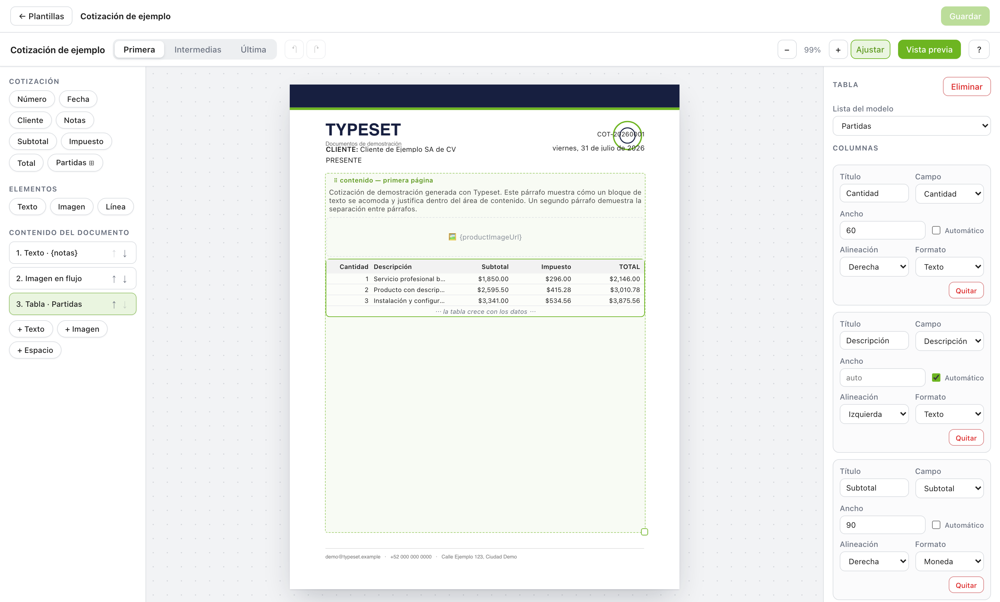
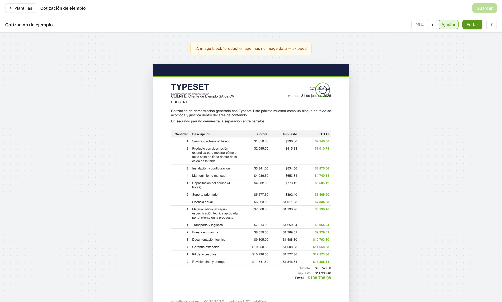

# Typeset

Design document templates visually. Render them anywhere.

Typeset is a visual template designer and a headless PDF renderer in one
package. Users drag data fields onto a page, tables grow with real data
across pages, and any app can turn a saved template plus a record into a
finished PDF, on the server or in the browser.



## Features

- **Visual editor**: drag fields from your data model onto the page, move
  and resize them with snap guides, edit text in place with a double click,
  undo and redo everything.
- **Real data preview**: preview mode runs the actual rendering engine on
  sample data. What you see is exactly what ships, because it is the output.
- **Growing tables**: bind a table to a list (order items, invoice concepts)
  and it grows row by row, overflowing onto continuation pages with repeated
  headers and totals that never get orphaned.
- **Multi-page layouts**: the first page, the middle pages and the last page
  can each have their own design and their own background PDF. Elements can
  be scoped to any of them and pinned to the bottom edge.
- **Letterhead support**: upload an existing PDF (letterhead, institutional
  design) and place dynamic fields on top of it.
- **Templates module**: a drop-in section with the templates list, a creation
  wizard and the editor, wired to your persistence through a small storage
  adapter interface.
- **Headless renderer**: `renderPdf(template, data)` runs in Node route
  handlers and in the browser, performs zero I/O of its own, and is the same
  engine the editor previews with.
- **Made for non-technical users**: guided first-run tour, contextual hints,
  friendly validation, no coordinates required (they exist, but under an
  "Advanced" fold).
- **Themeable**: one `theme` prop (or CSS variables) rebrands the entire UI
  to the host app.

## How it works

1. Your app describes its models with a `ModelDescriptor`: field keys,
   labels, types and a sample record.
2. Users design templates in the editor. A template is plain JSON: elements
   with page scopes, an optional content flow (tables, text blocks, images)
   and references to background assets.
3. At generation time the app calls `renderPdf` with the template and a data
   record. Field bindings are dot paths into that record, so there is no
   mapping layer in between.

Storage stays in your hands on both sides: templates persist through a
`TemplateStorageAdapter` you implement, and binary assets (backgrounds,
logos) resolve through an `AssetResolver`, so files live wherever your app
already keeps them.

## Installation

The package is published on a private registry under the `@pibytelabs`
scope. Route the scope in your `.npmrc`, then install:

```sh
npm install @pibytelabs/typeset
```

Peer dependencies: `pdf-lib` and `zod` always; `react`, `react-dom`,
`react-pdf` and `pdfjs-dist` only if you use the editor UI;
`@pdf-lib/fontkit` only for custom font assets.

`pdf-lib` is loaded lazily on the first `renderPdf` call, so it never lands in
your app's boot bundle.

## Quick start: generate a PDF

```ts
import { parseTemplate } from '@pibytelabs/typeset/core';
import { renderPdf } from '@pibytelabs/typeset/render';

const template = parseTemplate(savedTemplateJson); // validates + migrates

const pdfBytes = await renderPdf({
  template,
  data: invoice, // plain object, dot-path bindings
  assets: {
    async resolve(assetId) {
      return await loadBytesFromWhereverYouKeepThem(assetId);
    }
  }
});
```

## Quick start: the templates UI

```tsx
import { TemplatesModule } from '@pibytelabs/typeset/module';
import '@pibytelabs/typeset/editor/styles.css';

<TemplatesModule
  storage={myStorageAdapter}   // list / get / save / remove
  models={[invoiceModel]}      // ModelDescriptor[]
  assets={myAssetResolver}
  onAssetUpload={uploadToMyStorage}
  workerSrc={pdfjsWorkerUrl}
  theme={{ accent: '#121c38' }}
/>;
```

Need only the canvas? `<TemplateEditor value onChange models assets />` is a
controlled component you can embed on its own.



## Entry points

| Import | Contents | Environment |
|---|---|---|
| `@pibytelabs/typeset/core` | Template types, zod schema, `parseTemplate`, `createTemplate`, `validateTemplate`, `ModelDescriptor`, formatting | anywhere |
| `@pibytelabs/typeset/render` | `renderPdf`, `planLayout`, asset resolvers | Node 18+ and browser |
| `@pibytelabs/typeset/editor` | `<TemplateEditor/>`, `setupPdfWorker`, theming helpers | browser (React 19) |
| `@pibytelabs/typeset/module` | `<TemplatesModule/>`, `TemplateStorageAdapter`, `localStorageAdapter` | browser (React 19) |
| `@pibytelabs/typeset/editor/styles.css` | compiled styles for editor and module | import once |

## Concepts in one minute

- **Coordinates** are PDF points with a top-left origin. Page size comes from
  the document type chosen in the wizard (carta 612x792, oficio 612x936, or
  custom).
- **Elements** (`field | text | image | line`) are absolutely positioned and
  carry a page scope: `first`, `middle`, `last` or `all`. `anchor: 'bottom'`
  pins an element to the bottom edge (footers, signature blocks).
- **Flow** is an ordered stack (`table | text-block | image-block | spacer`)
  laid out top-down inside a region. Content that does not fit continues on
  the next page automatically.
- **Templates are versioned JSON**: always load them through
  `parseTemplate`, which validates, migrates old versions forward and
  refuses versions newer than the installed library.

## Theming

```tsx
<TemplatesModule theme={{ accent: '#0f766e', surface: '#f8fafc' }} ... />
```

or, from a global stylesheet:

```css
.my-app {
  --pde-accent: #0f766e;
}
```

Available keys: `accent`, `accentSoft`, `surface`, `panel`, `border`,
`text`, `muted`, `danger`. Anything you omit keeps its default, and the soft
accent tint follows your accent automatically.

## Integration guide

The full wiring reference lives in
[docs/integration.md](docs/integration.md): writing a `ModelDescriptor`
(and why its `sample` matters), implementing the storage adapter, the assets
contract, the pdfjs worker setup and the template JSON lifecycle.

## Development

```sh
npm install
npm test            # layout engine units + render integration
npm run typecheck
npm run build       # tsup: ESM + CJS + d.ts
npm run playground  # local demo app on http://localhost:5188
```

The playground ships with a fictional demo template and generated demo
assets, so you can exercise the whole loop (list, wizard, editor, preview)
without any backend.

## License

UNLICENSED. Internal tooling; all rights reserved.
